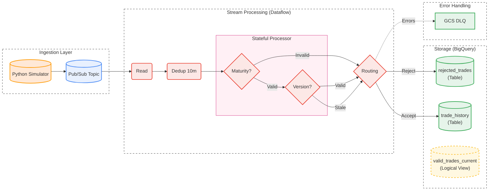

# Real-Time Trade Processing Pipeline on GCP


## 📖 Project Overview

This project implements a scalable, **event-driven ETL (Extract, Transform, Load) pipeline** for processing financial trade data using Google Cloud Platform (GCP).

The system simulates high-throughput trade events and ingests them via **Cloud Pub/Sub**. A streaming **Apache Beam** job (Dataflow) validates and processes the data, writing windowed files to **Cloud Storage (GCS)**.

To ensure decoupling and scalability, the loading into the Data Warehouse is event-driven: a **Cloud Run Function** is triggered automatically when new files land in GCS, loading the data into **BigQuery** for analysis.

---

## 🏗️ Architecture

The following diagram illustrates the event-driven flow from simulation to analytics.

```mermaid
graph LR
    %% Definitions for styling
    classDef compute fill:#e8f0fe,stroke:#4285f4,stroke-width:2px;
    classDef storage fill:#e6f4ea,stroke:#34a853,stroke-width:2px;
    classDef messaging fill:#fce8e6,stroke:#ea4335,stroke-width:2px;
    classDef orchestrate fill:#fef7e0,stroke:#fbbc05,stroke-width:2px;
    classDef local fill:#f1f3f4,stroke:#9aa0a6,stroke-width:2px,stroke-dasharray: 5 5;

    subgraph Source [Trade Source]
        A[Local Python Script]:::local
    end

    subgraph Ingestion [Ingestion & Orchestration]
        C(Cloud Composer):::orchestrate
        B(Cloud Pub/Sub):::messaging
    end

    subgraph Process [Processing]
        D{{Cloud Dataflow}}:::compute
    end

    subgraph Sinks [Storage & Analytics]
        F[GCS: Valid]:::storage
        G[GCS: Rejected]:::storage
        H(Cloud Run Function):::compute
        E[BigQuery]:::storage
    end

    %% Data Flow Connections
    A -->|JSON Events| B
    C -.->|Trigger| D
    B -->|Stream| D

    %% Processing Logic Flows
    D -->|Write Windowed Files| F
    D -->|Write Windowed Files| G
    
    %% Event Driven Load
    F -.->|Cloud Run Function Trigger| H
    G -.->|Cloud Run Function Trigger| H
    H -->|Load Job| E
```


### Data Flow Description

1.  **Ingestion:** A local Python script generates mock trade data (JSON format) and publishes it to a **Cloud Pub/Sub** topic (`trade-events`).
2.  **Orchestration:** A **Cloud Composer (Airflow)** DAG triggers and monitors the streaming Dataflow job, ensuring pipeline health.
3.  **Processing (ETL):** The **Apache Beam** pipeline running on **Cloud Dataflow**:
    * Reads streaming data from Pub/Sub.
    * Decodes and parses the JSON payloads.
    * **Validation Logic:** Applies business rules, specifically checking if the `maturity_date` is in the past.
4.  **Branching & Routing:**
    * **Valid Trades:** Batched into 60-second windows and written to a "Valid" **GCS** bucket. 
    * **Rejected Trades:** Batched into 60-second windows and written to a "Rejected" **GCS** bucket.
5.  **Data Warehouse Layer:**
    * **Valid Trades (Real-time):** Streamed immediately into **BigQuery** for instant availability in dashboards.
    * **Rejected Trades (Real-time):** Streamed immediately into **BigQuery** for instant availability in dashboards.
      
## 📂 File Structure

```text
├── main.py                        # Entry point; detects GCP project & starts simulation producer
├── pubsub_manager.py              # Helper class for Pub/Sub topic connection and publishing
├── generate_trade_payload.py      # Logic to create mock trade data attributes
├── trade_processing_orchestration.py # Airflow DAG for Cloud Composer
└── trade_processor_pipeline.py    # Core Apache Beam pipeline (Validation, Windowing)
── cloud-run-function-trigger_valid   # Move data from GCS Bucket to Big Query in real time
── cloud-run-function-trigger_rejected # Move data from GCS Bucket to Big Query in real time
```

## 🚀 Key Features

* **Real-Time Streaming Analytics:** Latency measured in seconds from ingestion to BigQuery availability.
* **Dual-Path Output:** Simultaneously feeds a data warehouse (BigQuery) for analytics and a data lake (GCS) for archival.
* **Data Validation & Error Handling:** Automatically filters invalid trades, routing them to separate storage for audit purposes.
* **Event Simulation:** Includes a robust generator for valid trades, expired trades, and version updates to test pipeline logic.
* **Infrastructure as Code:** Entire pipeline logic and orchestration defined in Python.


    
    %% View Logic (Dependency)
    HistTable -.->|Calculates State| CurrentView
