# Real-Time Trade Analytics Platform: Architecture Design

## 1. Executive Summary
This document outlines the architecture for the **Enterprise Trade Analytics Platform**. The system is designed to ingest, validate, and process high-volume financial trade events (Stocks, ETFs) with strict data quality guarantees. It enforces complex business rules—including version control, maturity validation, and historical data management—delivering a "Bi-Temporal" view of data (Transaction Time vs. Valid Time).

---

## 2. High-Level Architecture Diagram
The architecture follows a standard **Event-Driven ETL** pattern, utilizing Google Cloud services for scalability and fault tolerance.

```mermaid
graph LR
    %% --- STYLES ---
    classDef gcp fill:#e8f0fe,stroke:#4285f4,stroke-width:2px;
    classDef py fill:#ffe8d6,stroke:#ff9900,stroke-width:2px;
    classDef storage fill:#e6f4ea,stroke:#34a853,stroke-width:2px;
    classDef logic fill:#fce8e6,stroke:#ea4335,stroke-width:2px;
    classDef view fill:#fff8e1,stroke:#fbc02d,stroke-width:2px,stroke-dasharray: 5 5;

    %% --- EXTERNAL SOURCE ---
    Sim[("Python Simulator<br/>(Market Data)")]:::py

    %% --- MAIN SYSTEM BOUNDARY ---
    subgraph Platform ["☁️ Google Cloud Trade Analytics Platform"]
        style Platform fill:#f9f9f9,stroke:#333,stroke-width:4px
        
        %% 1. INGESTION
        subgraph Ingestion ["Ingestion Layer"]
            style Ingestion fill:#fff,stroke:#bbb,stroke-dasharray: 5 5
            PubSub[("Pub/Sub<br/>Topic: trade-events")]:::gcp
        end

        %% 2. PROCESSING
        subgraph Processing ["Stream Processing (Dataflow)"]
            style Processing fill:#fff,stroke:#bbb,stroke-dasharray: 5 5
            
            Read(Read Stream):::logic
            Dedup(Dedup Window<br/>10 mins):::logic
            
            subgraph StatefulProcessor ["Stateful Processor"]
                style StatefulProcessor fill:#fff0f5,stroke:#d63384
                CheckMaturity{Check 1:<br/>Maturity?}:::logic
                CheckVersion{Check 2:<br/>Version?}:::logic
            end
            
            Split{Router}:::logic
        end

        %% 3. STORAGE
        subgraph Storage ["Storage Layer (BigQuery)"]
            style Storage fill:#fff,stroke:#bbb,stroke-dasharray: 5 5
            
            RejectTable[("rejected_trades<br/>(Dead Letter Table)")]:::storage
            HistTable[("trade_history<br/>(Immutable Ledger)")]:::storage
            
            %% View
            CurrentView[("valid_trades_current<br/>(Live View)")]:::view
        end

        %% 4. ERROR HANDLING
        subgraph GCS ["Error Handling"]
            style GCS fill:#fff,stroke:#bbb,stroke-dasharray: 5 5
            DLQ_Files["GCS Bucket<br/>(Insert Failures)"]:::storage
        end
    end

    %% --- CONNECTIONS ---
    Sim ==>|JSON Events| PubSub
    PubSub ==> Read
    Read --> Dedup
    Dedup --> CheckMaturity

    %% Processor Logic
    CheckMaturity -->|Valid| CheckVersion
    CheckMaturity -->|Invalid| Split
    CheckVersion -->|Valid| Split
    CheckVersion -->|Stale| Split

    %% Routing
    Split -->|Reject Logic| RejectTable
    Split -->|Accept Logic| HistTable
    
    %% Error Path
    Split -.->|Schema Errors| DLQ_Files
    
    %% View Logic
    HistTable -.->|Query Definition| CurrentView
```

### Data Flow Narrative

A. **Ingestion**
   The Trade Simulator generates realistic financial messages (JSON) and publishes them to **Cloud Pub/Sub**.

B. **Stream Processing (Dataflow)**
   * **Deduplication:** Handles "at-least-once" delivery using a **10-minute windowing strategy**.
   * **Stateful Validation:** A `Stateful DoFn` validates trade versions against a persistent memory state to reject out-of-order amendments.
   * **Business Logic:** Enforces **Maturity Rules** (Reject vs. Expire) based on the lifecycle stage.

C. **Routing**
   * **Valid Trades** $\rightarrow$ Flow to the **BigQuery Ledger** (`trade_history`).
   * **Invalid Trades** $\rightarrow$ Routed to the **Dead Letter Table** (`rejected_trades`) for audit.

D. **Reporting**
   A scheduled ELT process synthesizes the **"Current State"** (`valid_trades_current`) from the history ledger.

## 3. Core Design Patterns

### A. Event Sourcing (The "Ledger" Concept)
We treat every trade update not as a database "UPDATE" but as a new **immutable event**.
* **Principle:** We never overwrite history. Every version (1, 2, 3) is stored.
* **Benefit:** Provides a 100% Audit Trail for regulatory compliance. We can reconstruct the state of any trade at any point in time.

### B. The "Hospital" (Dead Letter Queue)
No data is ever silently discarded.
* **Schema Failures:** Malformed JSON or type mismatches are caught and isolated.
* **Business Failures:** Trades with logical errors (e.g., "Maturity Date < Today" for a New Trade) are rejected but logged with a specific `rejection_reason`.

### C. Bi-Temporal State Management
The system distinguishes between two timelines:
* **Transaction Time (`timestamp`):** When the trade actually happened in the market.
* **System Time (`ingest_timestamp`):** When our platform received the data.

This allows us to handle "Late Arriving Data" correctly without corrupting reports

## 4. Component Technical Specifications

### A. Ingestion Layer
* **Source:** Python-based Trade Simulator (simulating an Order Management System).
* **Transport:** Cloud Pub/Sub (`trade-events` topic).
* **Payload:** JSON (UTF-8).
* **Key Fields:** `trade_id` (UUID), `version` (Int), `maturity_date` (ISO-8601).

### B. Processing Layer (Apache Beam / Dataflow)
* **Pipeline Type:** Streaming (Unbounded).
* **Validation Logic:** Pydantic Models for strict type checking.
* **Stateful Processing:** Uses `ReadModifyWriteStateSpec` to cache the `max_version` for every Trade ID, ensuring we reject stale updates (e.g., receiving Version 1 after Version 2).

### C. Storage Layer (BigQuery)

| Table Name | Role | Schema Definition | Partitioning |
| :--- | :--- | :--- | :--- |
| **`trade_history`** | **The Source of Truth.** Contains every valid version of every trade. | `trade_id`, `version`, `status`, `price`... | Daily (`timestamp`) |
| **`rejected_trades`** | **The Audit Log.** Contains invalid data and the reason for failure. | `rejection_id`, `reason`, `raw_payload` | Daily (`ingest_timestamp`) |
| **`valid_trades_current`** | **The Reporting View.** Contains only the single latest active version per trade. | Same as history, but unique by `trade_id`. | Daily (`timestamp`) |

## 5. Functional Logic (The "Processor")

The **Stateful Processor** implements this precise decision tree for every incoming record:

### A. Check Maturity
   * *Is `maturity_date < Today`?*
     * **YES:** Check if it is marked as `is_historical_load`?
       * **No** $\rightarrow$ **REJECT** (Reason: *"Invalid Maturity"*)
       * **Yes** $\rightarrow$ **ACCEPT** (Set `status='EXPIRED'`)

### B. Check Version
   * *Is `incoming_version < stored_version`?*
     * **YES:** $\rightarrow$ **REJECT** (Reason: *"Stale Version"*)

### C. Persist
   * Write record to `trade_history`.
   * Update internal State (`max_version`).
